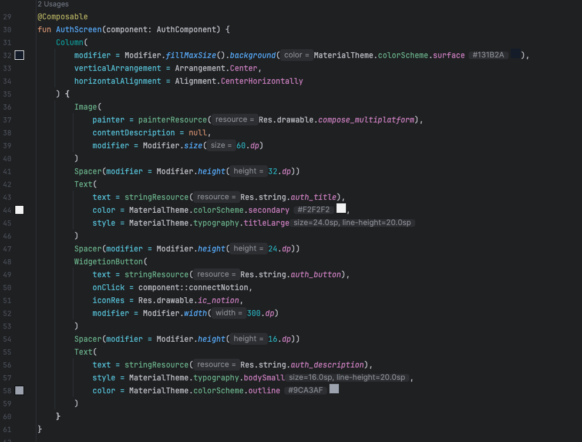
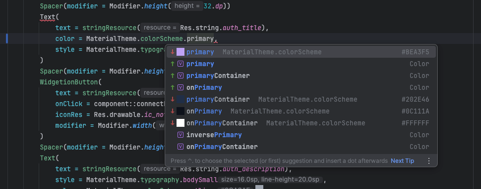
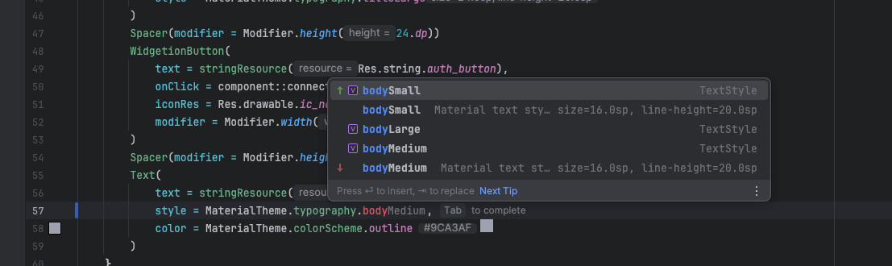

# 🧩 Material Theme Preview

Enhance your Android & Kotlin development experience with **real-time Material Design previews** right inside your editor.

---

### ✨ Features

- 🎨 Inline color squares for `MaterialTheme.colorScheme.*`
- 🅰️ Typography previews showing font size & line height
- 🧱 Shape previews with corner radius visualization
- 💡 Smart autocompletion with visual hints
- ⚡ Compatible with Kotlin K2 mode

### 🖼️ Screenshots

  
   
  Inline color & typography preview

  
   
  Code completion with color scheme

  
   
  Code completion with shapes

### 🧩 Installation

1. Open **Settings → Plugins → Marketplace**
2. Search for “Material Theme Preview”
3. Click **Install**

or manually:  
Download `.zip` from [GitHub Releases](https://github.com/tungnk123/material-theme-preview/releases)

### ⚖️ License
Licensed under the [Apache License 2.0](https://www.apache.org/licenses/LICENSE-2.0).  
© 2025 tungnk123
